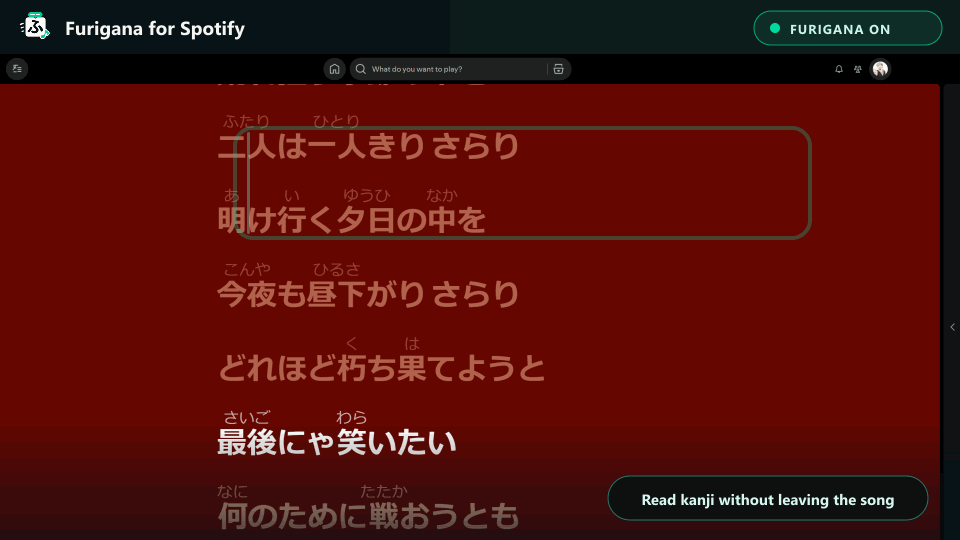

<p align="center">
  <strong>English</strong> · <a href="./docs/README.zh-CN.md">简体中文</a> · <a href="./docs/README.ja.md">日本語</a>
</p>

<p align="center">
  
</p>

<h1 align="center">Furigana for Spotify</h1>

<p align="center">
  <strong>Read the kanji. Catch the lyric. Stay with the song.</strong>
  <br />
  Furigana inside Spotify Desktop on Windows and macOS, with a transparent two-line desktop lyric overlay on both platforms in v0.6.3.
  <br />
  Local by default · No Spotify credentials required
</p>

<p align="center">
  <a href="https://github.com/huiishan99/extension-Furigana-for-Spotify/actions/workflows/ci.yml"></a>
  <a href="https://github.com/huiishan99/extension-Furigana-for-Spotify/releases/latest"></a>
  <a href="https://github.com/huiishan99/extension-Furigana-for-Spotify/stargazers"></a>
  
  
  
  <a href="./LICENSE"></a>
</p>

<p align="center">
  <a href="https://github.com/huiishan99/extension-Furigana-for-Spotify/releases/latest"></a>
</p>

> [!IMPORTANT]
> This is an independent community project. It is not affiliated with, sponsored by, or endorsed by Spotify AB. The project mark does not use the official Spotify logo; the mark inside the compatibility badge only identifies the target platform.

> [!TIP]
> If one chorus feels easier to follow, consider [giving the project a star](https://github.com/huiishan99/extension-Furigana-for-Spotify). It helps more Japanese learners find it.

> [!NOTE]
> **v0.6.3 distribution:** this guide covers the Windows Setup wizard, native Windows launcher, native macOS desktop-lyrics window, and updater repair in v0.6.3. Use the assets on the [v0.6.3 release page](https://github.com/huiishan99/extension-Furigana-for-Spotify/releases/tag/v0.6.3) once they are published: `spotify-furigana-v0.6.3.zip`, `Furigana-for-Spotify-Setup-v0.6.3.exe`, and each file’s matching `.sha256`. See the [release notes](./docs/releases/v0.6.3.md). Existing Windows installations through v0.6.2 need the one-time manual update described below.

## Japanese lyrics, made readable

<p align="center">
  
</p>

<p align="center">
  <sub>Animated from a real capture on Windows 11 · Spotify 1.2.97.270 · Spicetify 2.44.0. <a href="./assets/screenshots/lyrics-view.png">View the full screenshot.</a> Lyrics, artwork, and Spotify UI elements belong to their respective rights holders and appear here only to demonstrate the extension.</sub>
</p>

No separate player and no copying lyrics into another app. Open Spotify's lyrics view and the readings appear where you are already listening.

| Original lyric | With furigana |
| --- | --- |
| 声も聞かさないで | <ruby>声<rt>こえ</rt></ruby>も<ruby>聞<rt>き</rt></ruby>かさないで |
| 明日は晴れる | <ruby>明日<rt>あした</rt></ruby>は<ruby>晴<rt>は</rt></ruby>れる |

## Built to stay out of the way

- **Read inside Spotify**: furigana follows the lyrics you already use, including known fullscreen layouts.
- **Keep the next line in sight**: on Windows and macOS, a draggable transparent overlay stays above other apps, with the current line large and the next line ready underneath—then smoothly sliding upward when its turn comes.
- **Start private and offline**: the bundled local dictionary handles readings on your computer; no Spotify login or credentials are needed.
- **Use the intended pronunciation when available**: optional synchronized readings improve song-specific, uncommon, and deliberately altered readings, with a safe local fallback.
- **Handle everyday Japanese better**: common counters such as `一人` / `1人` → `ひとり` and `二人` / `2人` → `ふたり` are corrected locally without changing words such as `一人称` or `二人三脚`.
- **Make it comfortable**: choose hiragana, katakana, or romaji and tune reading size, opacity, spacing, and interface language.
- **Keep listening after supported Spotify updates**: the branded launcher can reapply Spicetify before opening Spotify. Windows installations through v0.6.2 need a one-time manual update to v0.6.3 to restore release updates; see [Update](#update).

## Requirements

- Windows 10/11, or macOS 12 or later
- Spotify Desktop: on Windows, use the [spotify.com build](https://www.spotify.com/download/windows/) or Microsoft Store build (install only one); on macOS, use the [spotify.com build](https://www.spotify.com/download/mac/)
- [Spicetify](https://spicetify.app/docs/getting-started)

Previously verified on real hardware with:

| Platform | OS | Spotify | Spicetify |
| --- | --- | --- | --- |
| Windows | Windows 11 Pro 10.0.26200 | Microsoft Store 1.2.97.270 | 2.44.0 |
| macOS | macOS 26.5.1, Apple silicon | spotify.com 1.2.98.301 | 2.44.0 |

Other versions may work, but have not been individually verified.

Automated checks cover Linux, macOS, and Windows, including the universal native macOS overlay and Windows release packaging. No new live Spotify-client validation was performed during this release update; the table above records earlier real-client results.

See the [compatibility matrix](./docs/COMPATIBILITY.md) for more version information.

## Install in a few minutes

<p>
  <a href="https://github.com/huiishan99/extension-Furigana-for-Spotify/releases/latest"></a>
</p>

For v0.6.3, use the [versioned release page](https://github.com/huiishan99/extension-Furigana-for-Spotify/releases/tag/v0.6.3) once its assets are published. Windows users can choose `Furigana-for-Spotify-Setup-v0.6.3.exe`; the cross-platform `spotify-furigana-v0.6.3.zip` contains Windows and macOS install scripts. Each download has a matching `.sha256` checksum file. Use these release assets, rather than GitHub’s automatically generated source-code ZIP.

**Install Spotify Desktop and Spicetify first.** The Windows Setup EXE installs Furigana; it does not install those prerequisites. Release users do not need Node.js, npm, or a browser extension.

### Windows

For script installation, extract `spotify-furigana-v0.6.3.zip` completely, open PowerShell in that folder, and run:

```powershell
powershell -ExecutionPolicy Bypass -File .\install.ps1
```

The script detects your single Spotify installation, backs up an existing Furigana installation, installs and enables the app, and applies the Spicetify configuration. It creates a **Furigana for Spotify** Start menu shortcut with the project’s original **ふ** icon.

**Windows Setup:** download `Furigana-for-Spotify-Setup-v0.6.3.exe` from the v0.6.3 release page when it is listed, then follow the wizard. Setup includes an optional desktop shortcut, automatic-update and launch choices, a native Windows launcher, a Start menu entry, and **Settings → Apps → Installed apps** registration. The desktop shortcut is selected by default.

After installation, open **Furigana for Spotify** from the Start menu. It checks and reapplies Spicetify before opening Spotify, so the extension can recover after supported Spotify updates. The v0.6.2 launcher’s release-update check is affected by the repository rename; it cannot install its own repair. See [Update](#update). Play a Japanese song with lyrics and open the lyrics view; the local dictionary may take a moment to load on the first conversion.

On Windows, the same launcher also starts the optional desktop-lyrics window. Turn on **Floating current lyric** in the sidebar settings to keep the synchronized line above other apps; drag it anywhere on the desktop. The overlay exits with Spotify and remembers its position for the next launch.

> [!IMPORTANT]
> Microsoft Store users must launch **Furigana for Spotify** instead of Spotify's regular shortcut. The generated launcher runs `spicetify auto` with the required app directory; opening the Store app directly will show the unmodified Spotify UI. Spicetify 2.44 officially lists support through Spotify 1.2.93; the Store 1.2.97 setup above is real-client tested by this project but remains outside Spicetify's official range.

### macOS

Open Terminal in the folder extracted from `spotify-furigana-v0.6.3.zip` and run:

```sh
sh ./install.sh
```

The installer supports Spotify in `/Applications` or `~/Applications`, validates Spotify's preferences, backs up an existing Furigana installation, configures and applies Spicetify, and creates **Furigana for Spotify.app** in `~/Applications` with the project's **ふ** icon. Open this launcher for future starts so it can check for official Furigana releases and run `spicetify auto` before launching Spotify. In v0.6.3, this launcher also starts the native macOS desktop-lyrics companion. Enable **Floating current lyric** in the sidebar settings to show the current and next lines above other apps.

## Update

> [!IMPORTANT]
> **Windows repository-rename recovery:** Windows updaters shipped through v0.6.2 reject the release URL after GitHub redirects to `huiishan99/extension-Furigana-for-Spotify`. They keep opening the installed version, but cannot download their own repair. Once the [v0.6.3 assets](https://github.com/huiishan99/extension-Furigana-for-Spotify/releases/tag/v0.6.3) are published, manually download `spotify-furigana-v0.6.3.zip`, extract it completely, and rerun `install.ps1` once. This installs the fixed updater; reinstalling v0.6.2 does not fix the issue.

Starting with `v0.5.0`, the **Furigana for Spotify** launcher includes an update check (subject to the Windows issue above). It checks the official latest GitHub Release at most once every 24 hours. When a newer stable version exists, it downloads the version-matched ZIP and `.sha256` file, verifies the archive, preserves the installed version as a timestamped backup, and upgrades before opening Spotify. There is no resident background updater.

If GitHub is unavailable, the checksum is invalid, or installation fails, the launcher records the error locally and opens the currently installed version. The update check sends no Spotify credentials, account data, track information, or lyrics; it makes only the normal HTTPS requests needed to read and download this project's public GitHub Release.

Users on `v0.4.3` or earlier have no updater and also need a manual installation. For manual updates, download and extract the chosen published Release ZIP, then run the commands below. Use v0.6.3 for the Windows repository-rename repair.

```powershell
powershell -ExecutionPolicy Bypass -File .\install.ps1
```

On macOS:

```sh
sh ./install.sh
```

To install without automatic Furigana updates, use `-DisableAutoUpdate` on Windows:

```powershell
powershell -ExecutionPolicy Bypass -File .\install.ps1 -DisableAutoUpdate
```

On macOS, use `SPOTIFY_FURIGANA_DISABLE_AUTO_UPDATE=1 sh ./install.sh`. Running the installer again without that option re-enables automatic updates.

## Customize the readings

Open **Furigana for Spotify** from Spotify's sidebar. The settings page lets you:

- follow Spotify's interface language automatically or choose English, Simplified Chinese, or Japanese;
- switch between hiragana, katakana, and romaji readings;
- adjust reading size from 30% to 75%;
- adjust opacity from 40% to 100%;
- add up to 8 px of vertical spacing;
- on Windows and macOS, show the current lyric plus a smaller next-line preview in a draggable, always-on-top desktop overlay, with independent size controls for both lines;
- restore the display defaults with one click.
- enable experimental online accurate readings and clear their local cache.

Changes are saved locally and apply immediately.

The Windows overlay and native macOS overlay use the same line-synced lyrics that Spotify already provides to its desktop client. The current and next rendered lines stay on your device and are neither saved nor uploaded. Communication is restricted to a fixed loopback listener; only the overlay's screen position is saved. It does not contact an additional lyrics service unless you separately enable accurate online readings.

## Optional accurate readings and privacy

Online accurate readings are **off by default**. When enabled, the extension sends the current public track title and artist to the GD Studio search endpoint, then requests the selected track's synchronized lyrics and romanization from NetEase Cloud Music. If strict artist matching fails because the services use different scripts, it sends the public artist name to MusicBrainz and accepts only a high-confidence verified alias such as `Fujii Kaze` ↔ `藤井風`. The Spotify album name is used only for local result ranking. It uses that pronunciation data only to annotate the matching Spotify lyric line.

The extension does not send Spotify credentials, cookies, account data, or the lyrics rendered by Spotify. “Synchronized” means timestamp-paired provider lyrics and romanization; the extension does not listen to or transcribe audio. Successful matches are cached locally for up to 30 days; unavailable matches are remembered for 6 hours to avoid repeated requests, with at most 30 tracks retained. The settings page can clear this cache at any time. Provider availability and song coverage are not guaranteed, so local reading rules and the dictionary remain the automatic fallback.

## Uninstall

For a Windows ZIP installation, run:

```powershell
powershell -ExecutionPolicy Bypass -File .\uninstall.ps1
```

On macOS:

```sh
sh ./uninstall.sh
```

For a Windows Setup installation, you can instead remove **Furigana for Spotify** from **Settings → Apps → Installed apps**.

## Troubleshooting

- **No Furigana page in the sidebar:** run `spicetify apply`, then restart Spotify.
- **The button appears but lyrics are unchanged:** make sure the song has Japanese lyrics containing kanji, enable the lyrics button, and wait briefly for the first local dictionary load.
- **Online accurate readings stay on the local fallback:** the provider may not have synchronized romanization, the album/version may not match safely, or the service may be temporarily unavailable. The extension deliberately refuses weak matches.
- **The app disappeared after a Spotify update:** close Spotify and open **Furigana for Spotify** from the Windows Start menu or `~/Applications` on macOS. If needed, run `spicetify backup apply` once.
- **The installer detects two Spotify installations:** keep either the Microsoft Store build or the [spotify.com build](https://www.spotify.com/download/windows/), remove the other, open the retained app for at least 60 seconds, then run the installer again.
- **Microsoft Store Spotify opens without Furigana:** close it and use **Furigana for Spotify** from the Start menu; do not use the regular Store shortcut.
- **macOS says Spotify or its preferences are missing:** install Spotify in `/Applications` or `~/Applications`, open it, sign in for at least 60 seconds, close it, and rerun `sh ./install.sh`.
- **The macOS launcher cannot find Spicetify:** reinstall Spicetify, open a new Terminal window, and rerun the Furigana installer so the launcher is rebuilt.
- **Need help with an issue:** open the Furigana app page and select **Copy diagnostics**. The report contains versions, settings, reading status, and selector counts, but never track titles, artists, lyrics, account data, or credentials.

## Known limitations

- Local mode handles common one- and two-person counters, but can still misread names, place names, wordplay, and intentionally unusual pronunciations. Online accurate readings improve supported songs but cannot cover every track or line.
- Spotify updates can change the lyrics DOM. If the extension stops working, include your Spotify and Spicetify versions in the issue.
- Web Player and mobile are not supported.

## Contributing

Found a problem or have an idea? Open an [Issue](https://github.com/huiishan99/extension-Furigana-for-Spotify/issues) or read [CONTRIBUTING.md](./CONTRIBUTING.md) before submitting a pull request.

Security issues should be reported privately as described in [SECURITY.md](./SECURITY.md).

## Share the project

The ready-to-post English, Chinese, and Japanese launch copy is available in [docs/LAUNCH_KIT.md](./docs/LAUNCH_KIT.md). If the extension helps you, a [GitHub star](https://github.com/huiishan99/extension-Furigana-for-Spotify) or a thoughtful compatibility report is the most useful support.

## Trademark notice

Furigana for Spotify is an independent open-source project. Spotify, the Spotify logo, and related brand elements are trademarks of Spotify AB. This project is not affiliated with, sponsored by, or endorsed by Spotify AB. “for Spotify” is used only to describe platform compatibility.

The project logo is an original design combining “ふ”, a ruby-annotation bar, and a music note. Its near-black, teal-emerald, and off-white palette suggests a music-streaming product while remaining distinct from Spotify Green; it does not use Spotify's circle, waves, or official logo. See the [Spotify Design & Branding Guidelines](https://developer.spotify.com/documentation/design).

## License

[MIT](./LICENSE)
