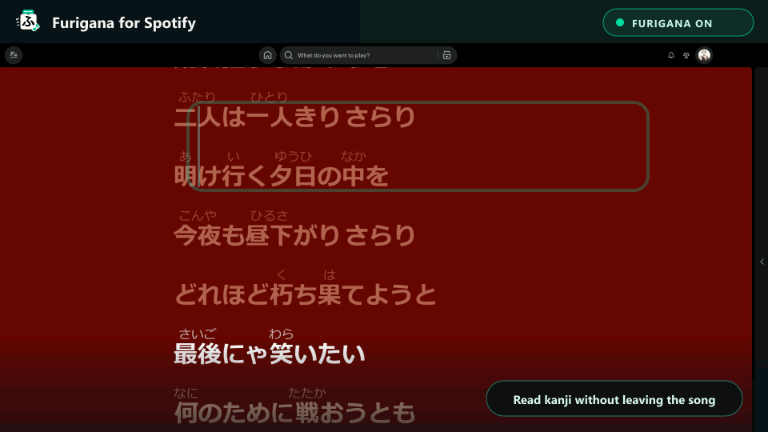

<p align="center">
  <a href="../README.md">English</a> · <a href="./README.zh-CN.md">简体中文</a> · <strong>日本語</strong>
</p>

<p align="center">
  
</p>

<h1 align="center">Furigana for Spotify</h1>

<p align="center">
  <strong>漢字を読んで、歌詞をつかんで、そのまま音楽の中へ。</strong>
  <br />
  Spotifyデスクトップの歌詞にふりがなを追加。Windowsでは透明な2行デスクトップ歌詞も使えます。
  <br />
  デフォルトはローカル処理 · 自動更新 · Spotify認証情報は不要
</p>

<p align="center">
  <a href="https://github.com/huiishan99/spotify-furigana/actions/workflows/ci.yml"></a>
  <a href="https://github.com/huiishan99/spotify-furigana/releases/latest"></a>
  <a href="https://github.com/huiishan99/spotify-furigana/stargazers"></a>
  
  
  
  <a href="../LICENSE"></a>
</p>

<p align="center">
  <a href="https://github.com/huiishan99/spotify-furigana/releases/latest"></a>
</p>

> [!IMPORTANT]
> 本プロジェクトは独立したコミュニティプロジェクトであり、Spotify ABとは関係がなく、同社による後援・承認も受けていません。プロジェクト独自のロゴにはSpotify公式ロゴを使用していません。互換性バッジ内のマークは対象プラットフォームを示すためだけに使用しています。

> [!TIP]
> サビの一節でも追いやすくなったら、ぜひ[プロジェクトにStarを付けてください](https://github.com/huiishan99/spotify-furigana)。ほかの日本語学習者が見つけるきっかけになります。

> [!NOTE]
> **v0.6.0の新機能：**Windowsのデスクトップ歌詞が透明な2行表示になりました。現在行を大きく、次の行を小さく先行表示し、より滑らかに切り替わります。

## 日本語の歌詞を、もっと読みやすく

<p align="center">
  
</p>

<p align="center">
  <sub>実機環境から作成：Windows 11 · Spotify 1.2.97.270 · Spicetify 2.44.0。<a href="../assets/screenshots/lyrics-view.png">全体のスクリーンショットを見る。</a>歌詞、アートワーク、SpotifyのUI要素に関する権利は各権利者に帰属し、この画像は拡張機能の動作を説明する目的でのみ掲載しています。</sub>
</p>

別のプレーヤーを開いたり、歌詞をコピーしたりする必要はありません。Spotifyの歌詞画面を開くだけで、いつもの場所に読みが表示されます。

| 元の歌詞 | ふりがな表示後 |
| --- | --- |
| 声も聞かさないで | <ruby>声<rt>こえ</rt></ruby>も<ruby>聞<rt>き</rt></ruby>かさないで |
| 明日は晴れる | <ruby>明日<rt>あした</rt></ruby>は<ruby>晴<rt>は</rt></ruby>れる |

## 聴くことを邪魔しない設計

- **Spotifyの中でそのまま読める**：いつもの歌詞にふりがなが付き、既知の全画面レイアウトにも対応します。
- **次の一行を先に確認**：Windowsの透明オーバーレイは好きな場所へ移動でき、ほかのアプリより前面に表示。現在行を大きく、次行を小さく表示します。
- **デフォルトはローカル、ログイン不要**：内蔵辞書が端末上で読みを変換し、Spotifyの認証情報も追加の歌詞サービスも必要ありません。
- **曲ならではの読み方にも対応**：任意の同期高精度読みで、珍しい読みや意図的に変えた発音を改善。安全に照合できない場合はローカル読みに戻ります。
- **日常的な表現をより確実に**：`一人` / `1人` → `ひとり`、`二人` / `2人` → `ふたり` をオフライン補正し、`一人称` や `二人三脚` などは誤って変更しません。
- **自分に合う表示へ**：ひらがな・カタカナ・ローマ字を選び、読みのサイズ、透明度、間隔、UI言語を調整できます。
- **一度入れたら、そのまま使える**：専用ランチャーが検証済みリリースを確認し、対応するSpotify更新後は拡張機能を復旧してからSpotifyを開きます。

## 必要環境

- Windows 10/11、または macOS 12以降
- Spotifyデスクトップ版：Windowsでは[spotify.com版](https://www.spotify.com/download/windows/)またはMicrosoft Store版（どちらか一方）、macOSでは[spotify.com版](https://www.spotify.com/download/mac/)
- [Spicetify](https://spicetify.app/docs/getting-started)

実機で確認済みの構成：

| コンポーネント | 確認済みバージョン |
| --- | --- |
| Windows | Windows 11 Pro 10.0.26200 |
| Spotify | Microsoft Store版 1.2.97.270 |
| Spicetify | 2.44.0 |

ほかのバージョンでも動作する可能性はありますが、個別の検証はまだ行っていません。

macOSインストーラーと本番ビルドはmacOS CIで自動検証していますが、実際のSpotifyクライアントでの確認報告はまだ登録されていません。そのため、macOSは新規対応であり、実機検証済みとはしていません。

詳しいバージョン情報は[互換性マトリクス](./COMPATIBILITY.md)を参照してください。

## 数分でインストール

<p>
  <a href="https://github.com/huiishan99/spotify-furigana/releases/latest"></a>
</p>

[最新のRelease](https://github.com/huiishan99/spotify-furigana/releases/latest)から `spotify-furigana-vX.Y.Z.zip` をダウンロードし、完全に展開してから、お使いのOSのインストーラーを実行します。既存版のバックアップとアプリ設定はインストーラーが行います。

### Windows

展開したフォルダーでPowerShellを開き、次を実行します。

```powershell
powershell -ExecutionPolicy Bypass -File .\install.ps1
```

インストーラーは一つだけインストールされたSpotifyを検出し、既存のFurigana版をバックアップしてアプリを有効化し、Spicetify設定を適用したうえで、スタートメニューに **Furigana for Spotify** ランチャーを作成します。このランチャーにはプロジェクト独自の **「ふ」アイコン**を使用し、通常のSpotifyショートカットと見分けやすくしています。

インストール後は、スタートメニューから **Furigana for Spotify** を開いてください。このランチャーは24時間に最大1回、公式のFurigana Releaseを確認し、Spotifyを開く前にSpicetifyを確認して再適用します。今後のFurigana機能が自動更新され、通常の再起動後も拡張機能が維持され、対応済みのSpotify更新後も自動復旧できます。歌詞のある日本語の曲を再生して歌詞画面を開いてください。初回変換時はローカル辞書の読み込みに少し時間がかかります。

Windowsでは、このランチャーが任意のデスクトップ歌詞ウィンドウも起動します。サイドバー設定の **現在の歌詞をフローティング表示** をオンにすると、ほかのアプリより前面に表示され、デスクトップ上をドラッグできます。Spotifyの終了時に一緒に終了し、次回起動時に位置を復元します。

> [!IMPORTANT]
> Microsoft Storeユーザーは、通常のSpotifyショートカットではなく **Furigana for Spotify** を使用してください。生成されたランチャーは `spicetify auto` で必要なアプリディレクトリを指定します。Storeアプリを直接開くと未変更のSpotify UIになります。Spicetify 2.44の公式対応範囲はSpotify 1.2.93までです。上記のStore 1.2.97構成は本プロジェクトで実機確認済みですが、Spicetifyの公式範囲外です。

### macOS

展開したフォルダーでターミナルを開き、次を実行します。

```sh
sh ./install.sh
```

インストーラーは `/Applications` または `~/Applications` のSpotifyに対応し、設定ファイルを確認して既存版をバックアップし、Spicetifyを設定・適用します。さらに、プロジェクト独自の **「ふ」アイコン**を使った **Furigana for Spotify.app** を `~/Applications` に作成します。今後はこのランチャーを使うと、公式Furigana Releaseが自動でインストールされ、Spotifyを開く前に `spicetify auto` が実行されます。

## 更新

`v0.5.0` 以降、**Furigana for Spotify** ランチャーは24時間に最大1回、GitHubの公式最新Releaseを確認します。新しい安定版がある場合、対応するZIPと `.sha256` をダウンロードして検証し、現在のバージョンをタイムスタンプ付きバックアップとして保存してから、Spotifyを開く前に更新します。常駐型のバックグラウンド更新プログラムはありません。

GitHubに接続できない場合、チェックサムが不正な場合、またはインストールに失敗した場合は、エラーをローカルに記録し、現在インストール済みのバージョンをそのまま開きます。更新確認ではSpotifyの認証情報、アカウント情報、曲情報、歌詞を送信せず、このプロジェクトの公開GitHub Releaseを確認・ダウンロードするための通常のHTTPSリクエストだけを行います。

`v0.4.3` 以前には更新機能がないため、`v0.5.0` を一度手動でインストールする必要があります。最新のRelease ZIPをダウンロードして展開し、次を実行します。

```powershell
powershell -ExecutionPolicy Bypass -File .\install.ps1
```

macOS：

```sh
sh ./install.sh
```

Furiganaの自動更新を使わない場合、Windowsではインストール時に `-DisableAutoUpdate` を追加します。

```powershell
powershell -ExecutionPolicy Bypass -File .\install.ps1 -DisableAutoUpdate
```

macOSでは `SPOTIFY_FURIGANA_DISABLE_AUTO_UPDATE=1 sh ./install.sh` を使用します。後でオプションなしでインストーラーを再実行すると、自動更新が再び有効になります。

## 読み表示のカスタマイズ

Spotifyのサイドバーから **Furigana for Spotify** を開くと、次の設定を変更できます。

- Spotifyの表示言語に自動で合わせる、またはEnglish・简体中文・日本語を個別に選択
- ひらがな・カタカナ・ローマ字の切り替え
- 読みのサイズを30%〜75%に調整
- 透明度を40%〜100%に調整
- 上下の間隔を最大8 px追加
- Windowsデスクトップ上で現在の歌詞とふりがなを表示し、その下に小さな次行プレビューを表示
- ワンクリックで表示設定を初期値に戻す
- 実験的なオンライン高精度読みを有効化し、ローカルキャッシュを消去

設定はローカルに保存され、すぐに反映されます。

Windowsのフローティングウィンドウは、Spotifyデスクトップ版が元から取得する行同期歌詞を使用します。現在行と次行は端末内だけで使用し、保存やアップロードは行いません。オンライン高精度読みを別途有効にしない限り、追加の歌詞サービスには接続しません。macOSでは現在、デスクトップ歌詞を利用できません。

## オンライン高精度読みとプライバシー

オンライン高精度読みは**デフォルトでオフ**です。有効にすると、現在の公開曲名とアーティスト名をGD Studioの検索エンドポイントへ送り、選択した曲の同期歌詞とローマ字をNetEase Cloud Musicから取得します。サービス間の表記体系が異なって厳密なアーティスト照合に失敗した場合は、公開アーティスト名をMusicBrainzへ送り、`Fujii Kaze` ↔ `藤井風` のような高信頼の確認済み別名だけを受け入れます。Spotifyのアルバム名はローカルでの候補選別にのみ使い、発音データは一致するSpotify歌詞行の注釈だけに使用します。

Spotifyの認証情報、Cookie、アカウント情報、Spotify画面に表示された歌詞は送信しません。ここでの「同期」は外部歌詞とローマ字のタイムスタンプ対応を意味し、音声を聴き取ったり文字起こししたりする機能ではありません。成功した結果は最大30日、見つからなかった結果は再リクエストを避けるため6時間、最大30曲までローカルにキャッシュします。設定画面からいつでも消去できます。外部サービスの稼働や曲の収録は保証されず、利用できない場合はローカル読み規則と辞書へ自動的に戻ります。

## アンインストール

```powershell
powershell -ExecutionPolicy Bypass -File .\uninstall.ps1
```

macOS：

```sh
sh ./uninstall.sh
```

## トラブルシューティング

- **サイドバーにFuriganaページがない：**`spicetify apply` を実行し、Spotifyを再起動してください。
- **ボタンはあるが歌詞が変わらない：**漢字を含む日本語歌詞がある曲か、歌詞ボタンがオンかを確認し、初回のローカル辞書読み込みを少し待ってください。
- **オンライン高精度読みがローカル辞書のまま：**同期ローマ字がない、アルバムや曲バージョンを安全に照合できない、またはサービスが一時的に利用できない可能性があります。不確かな一致は意図的に使用しません。
- **Spotify更新後にアプリが消えた：**Spotifyを閉じ、WindowsのスタートメニューまたはmacOSの `~/Applications` から **Furigana for Spotify** を開いてください。必要なら `spicetify backup apply` を一度実行します。
- **インストーラーがSpotifyを二つ検出した：**Microsoft Store版または[spotify.com版](https://www.spotify.com/download/windows/)のどちらか一方を残して他方を削除し、残した版を60秒以上開いてから再実行してください。
- **Microsoft Store版を開いてもFuriganaがない：**閉じて、スタートメニューの **Furigana for Spotify** を使用してください。通常のStoreショートカットは使用しません。
- **macOSでSpotifyまたは設定ファイルが見つからない：**Spotifyを `/Applications` または `~/Applications` にインストールし、60秒以上ログインしてから閉じ、`sh ./install.sh` を再実行してください。
- **macOSランチャーがSpicetifyを見つけられない：**Spicetifyを再インストールし、新しいターミナルを開いてからFuriganaインストーラーを再実行し、ランチャーを作り直してください。
- **Issueのために情報が必要：**Furiganaページで**診断情報をコピー**を選択してください。レポートにはバージョン、設定、読みの状態、セレクター数だけが含まれ、曲名、アーティスト、歌詞、アカウント情報、認証情報は含まれません。

## 既知の制限

- ローカルモードは一般的な一人・二人の人数読みを補正しますが、人名、地名、言葉遊び、特殊な読み方は誤る場合があります。オンライン高精度読みは対応曲を改善しますが、すべての曲や行を保証するものではありません。
- Spotifyの更新によって歌詞DOMが変わる可能性があります。突然動作しなくなった場合は、SpotifyとSpicetifyのバージョンをissueに記載してください。
- Web Playerとモバイル版には対応していません。macOSはインストール・ビルドの自動検証済みですが、公開できる実機検証報告を待っている段階です。

## コントリビューション

問題やアイデアがある場合は [Issue](https://github.com/huiishan99/spotify-furigana/issues) を開いてください。Pull Requestを送る前に [CONTRIBUTING.md](../CONTRIBUTING.md) を確認してください。

セキュリティ上の問題は [SECURITY.md](../SECURITY.md) の手順に従って非公開で報告してください。

## プロジェクトを共有する

[docs/LAUNCH_KIT.md](./LAUNCH_KIT.md) に英語、中国語、日本語の投稿文を用意しています。拡張機能が役立った場合は、[GitHubでStarを付ける](https://github.com/huiishan99/spotify-furigana)か、信頼できる互換性レポートを送ってもらえると助かります。

## 商標について

Furigana for Spotifyは独立したオープンソースプロジェクトです。Spotify、Spotifyロゴ、および関連するブランド要素はSpotify ABの商標です。本プロジェクトはSpotify ABとは関係がなく、同社による後援・承認も受けていません。「for Spotify」は対応プラットフォームを説明する目的でのみ使用しています。

プロジェクトロゴは「ふ」、ルビ注釈バー、音符を組み合わせたオリジナルデザインです。黒に近い色、青みのあるエメラルドグリーン、オフホワイトによって音楽ストリーミング製品を連想できる配色にしつつ、Spotify Greenとは区別し、Spotifyの円形、波形、公式ロゴは使用していません。詳しくは [Spotify Design & Branding Guidelines](https://developer.spotify.com/documentation/design) を参照してください。

## License

[MIT](../LICENSE)
